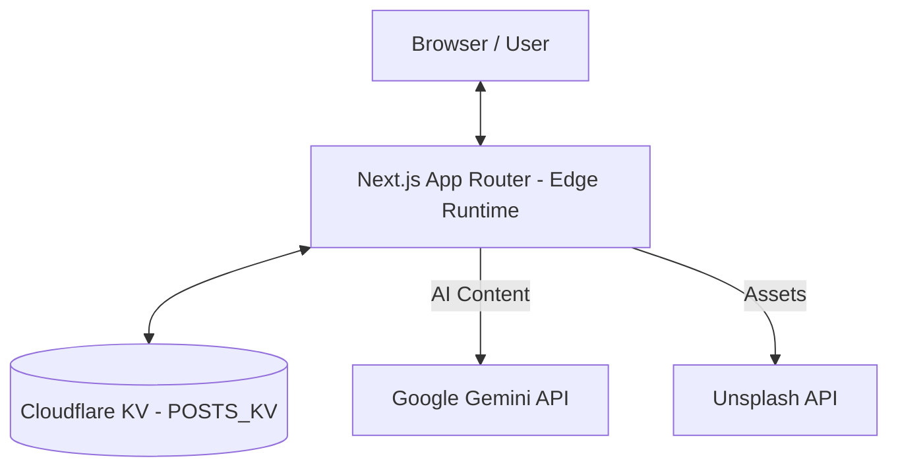

# Architectural Analysis: Adduckivity (Immersive Momentum)

This project is a high-performance, edge-first content management and visualization system built on the **Cloudflare Ecosystem**. It prioritizes low-latency interactions and minimalist serverless architecture.

## 1. System Overview
The system follows a **Decentralized Edge Architecture**, where both the frontend and backend logic are distributed globally via Cloudflare's network.

## 2. Key Components
- **Core (Edge Runtime)**: Leverages `next-on-pages` to run the entire Next.js application on Cloudflare Pages. This eliminates traditional "server" overhead and places logic closest to the user.
- **Persistence (Cloudflare KV)**: A high-read, low-latency key-value store used for post metadata and content. It avoids the complexity and latency of a traditional RDBMS.
- **Intelligence (Gemini Integration)**: Uses `gemini-1.5-flash` for real-time content assistance (SEO, tagging, outlines), integrated directly into the edge functions.
- **Visualization (R3F)**: Uses `@react-three/fiber` for immersive 3D "Flywheel" scenes, reflecting the "Momentum" concept visually without heavy backend processing.

## 3. Performance & Minimalism
- **Zero-Cold Starts**: By using Cloudflare KV and Edge Functions, the system avoids the cold-start latencies common in traditional lambda-based architectures.
- **Minimal Dependencies**: The backend logic for content management (`posts.ts`) is a pure script interacting with the `KVNamespace` binding, avoiding heavy ORMs.
- **Direct Edge Fetching**: API routes (like `/api/unsplash`) act as lightweight proxies, keeping secrets secure while maintaining edge performance.

## 4. Security
- **Environment Isolation**: Sensitive keys (Gemini, Unsplash) are managed via Cloudflare Environment Variables, never exposed to the client.
- **Type Safety**: End-to-end TypeScript usage, specifically leveraging Cloudflare's `KVNamespace` types and shared `Post` interfaces.
- **Edge Security**: Benefit from Cloudflare's built-in DDoS protection and WAF by default.

## 5. Recommendations
- **Asset Storage**: While KV is excellent for metadata, consider **Cloudflare R2** for large images if Unsplash isn't sufficient.
- **Caching**: Implement `Cache-Control` headers on edge routes to further reduce KV read costs and latency.
- **Consistency**: Since KV is eventually consistent, for immediate "Save & View" loops, ensure the client-side state is updated optimistically.
